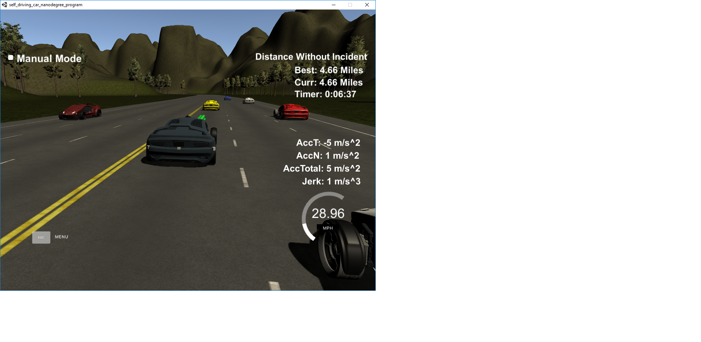
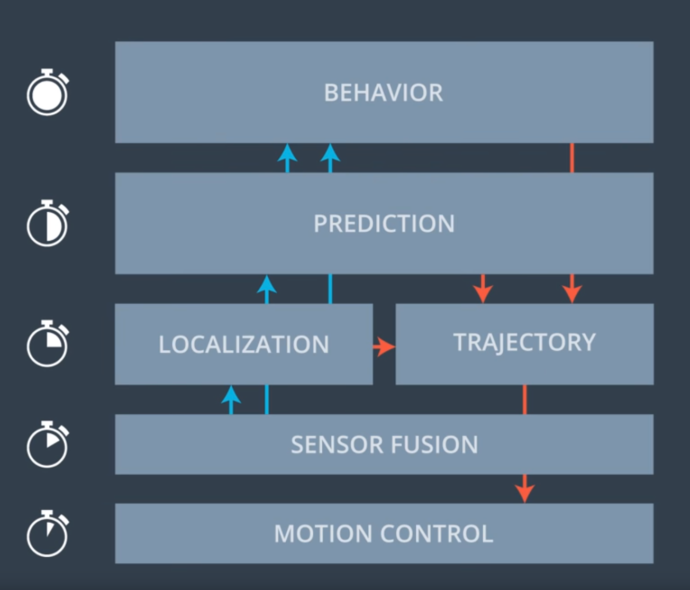

The algorithm developed is based on the topics, discussion that were learnt during the course. A model is built in a such way that it drives at least 4.32 miles without any incident and meeting the other constraint requirement related to speed, collision , acceleration and jerk constraints.

The image of simulator which satisfies the project scope i.e.. driving atleast 4.32 miles without any incident can be found below:

The function implemented is purely motivated and learnt based on the walk through during the course. Code can be built without any errors and ensures that the car is driven safe

As learnt during the course, the path planning requires the information from different layers and co-ordination among them in order to drive an autonomous vehicle. The layered architecture of autonomous vehicle could be found below:

A brief overview of how components in each layer works, together to build an autonomous vehicle is described in the next section.

Motion Control: Responsible for moving the car and following a reference trajectory as closely as possible by meeting the speed and lateral distance constraints

Sensor Fusion: If the vehicle has more than one sensor like camera, LIDAR or radar, then those outputs are merged in this component to get the perception details

Localization: It helps to locate where the vehicle is on the map, and where other entities are with respect to EGO vehicle(e.g..traffic lights, other vehicles or any other obstacles)

Prediction: Responsible for identifying nature of obstacle that is detected with sensors as well predicting future behavior based on the localization information

Behavior: This layer makes a decision based on the previous layer information what a vehicle should do or how a vehicle should behave e.g stop or exit from the intersection , lane change etc.,

Trajectory: Generataes a set of points consituting path in terms of time considering the speed, jerk, collision and other constraints

For this project scope, its concentrated only on the bit of prediction, behavior and trajectory generation. The other three layers information are already provided by built in simulator.

A basic simple prediction step is used to check if there are any cars in the left, front or right. How the lane information for these cars is obtained and predict where they will be future based on the simulator information. Code corresponding to this can be found from [138-194] lines with detailed comments in code.

Once the predicted data is avaiable, in the behavior section which corresponds to the code lines of [197- 238] helps to make decision whether lane change is allowed or not. And, how the speed of ego vehicle should be controlled like decrease or increase.

For trajectory generation an optimization code is implemented for the reference velocity calculation. Planner starts with previous path points. Checks if there is any previous path points or its empty. In case of empty, it choose the car position as reference position to make plan. But if there are already previous path points, then previous path last two points are added and considered as reference points. This section of corresponds to the code lines from [ 253-297]

After the reference points are obtained, four future points are added to it. A co-ordinate transformation is done using getXY function.[300-315]

For trajectory generation, a standard spline library definition is used as it eases the job and does the job of required function. The obtained points are converted back to vehicle co-ordinates and passed to spline function. The next_x_vals and next_y_vals are the points that needs to be passed to coontroller in order to have smooth desired trajectory. Thus, instead of starting a trajectory completely from scratch, the previous path points are used to make it faster and better.[334 - 349]

As we know spline is piecewise polynomial, here we split the points in a such way it meets the desired velocity target. The number of points is set to 50.  In case, if the there 20 previous points then 30 new points are added to create a path of total 50 points. Also, the reference velocity is set based on the behavior information we had obtained. In case, the vehicle is in start position i.e.. velocity=0 then start the vehicle with some minimum velocity say 2mph.The code corresponds to the lines from [352-402].

The code contains the detailed possible comments for every line of code. The walkthrough session helped a lot to get the code run on simulator safely. However, there is a possibility that it could be improved further by considering the cost function, using the quintic polynmoial function. Spline sometimes might fail to work in a highly curved paths. So higher degree of polynomial helps in such cases.
